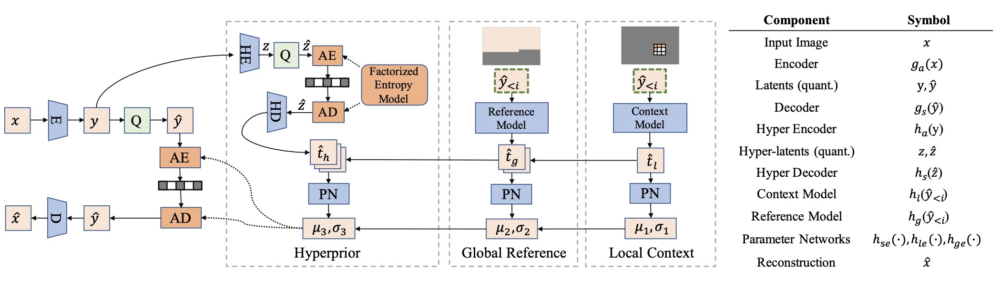
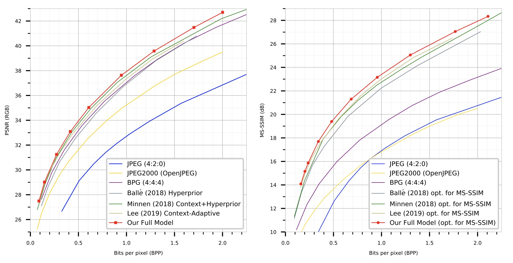

 

# [ICLR2021] Learning Accurate Entropy Model with Global Reference for Image Compression [[pdf]](https://arxiv.org/abs/2010.08321)

The official repository for [Learning Accurate Entropy Model with Global Reference for Image Compression](https://arxiv.org/abs/2010.08321).

## Pipeline



## Evaluation on [Kodak](http://r0k.us/graphics/kodak/) Dataset



## Requirements

### Prerequisites

Clone the repo and create a conda environment as follows:


```bash
conda create --name ref python=3.6
conda activate ref
conda install pytorch=1.1 torchvision cudatoolkit=10.0
```

(We use PyTorch 1.1, CUDA 10.1.)

### Test Datasets

[Kodak](http://r0k.us/graphics/kodak/) Dataset

```
kodak
├── image1.jpg 
├── image2.jpg
└── ...
```

## Evaluation & Comress & Decompress

**Evaluation:**

```bash
# Kodak
sh test.sh [/path/to/kodak] [model_path]
```

**Compress:**

```bash
sh compress.sh original.png [model_path]
```

**Decompress:**

```bash
sh decompress.sh original.bin [model_path]
```

## Trained Models

Download the pre-trained [models](https://drive.google.com/drive/folders/1YH8P5XCKCc0UcMJTCX-Y4xSIIcbD2uLN?usp=sharing) optimized by MSE.

Note: We reorganize code and the performances are slightly different from the paper's.

## Acknowledgement

Codebase from [L3C-image-compression](https://github.com/fab-jul/L3C-PyTorch) , [torchac](https://github.com/fab-jul/torchac)

## Citation

If you find this code useful for your research, please cite our paper

```
@InProceedings{Yichen_2021_ICLR,
    author    = {Qian, Yichen and Tan, Zhiyu and Sun, Xiuyu and Lin, Ming and Li, Dongyang and Sun, Zhenhong and Li, Hao and Jin, Rong},
    title     = {Learning Accurate Entropy Model with Global Reference for Image Compression},
    booktitle = {International Conference on Learning Representations},
    month     = {May},
    year      = {2021},
}
```

